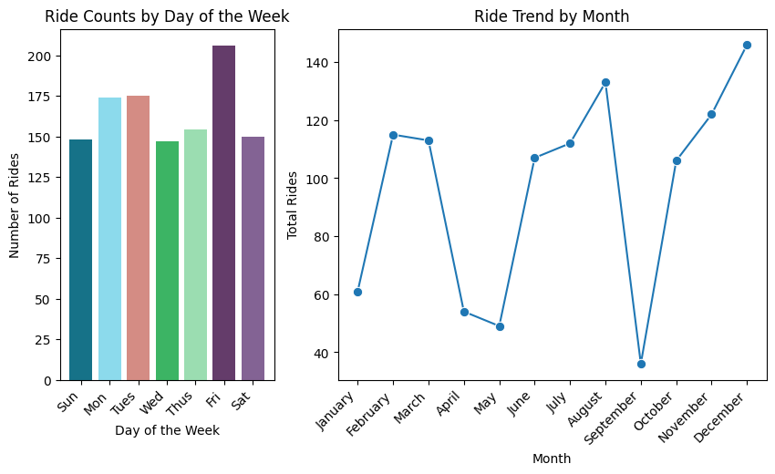
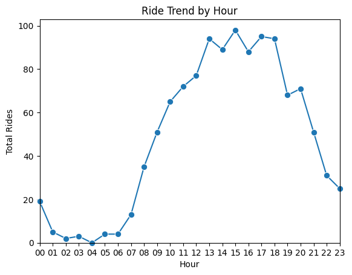
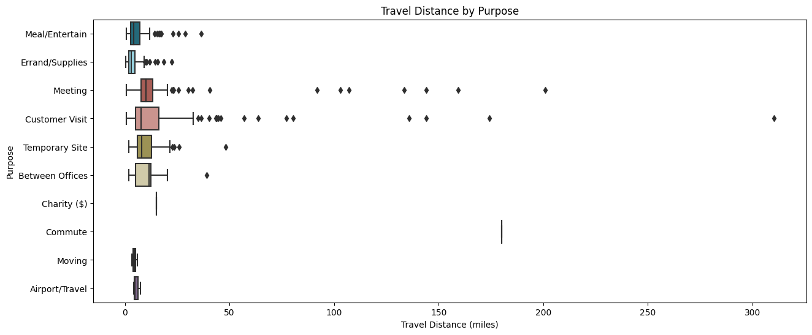
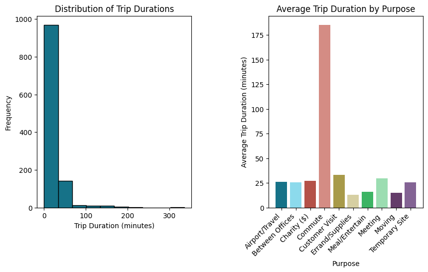
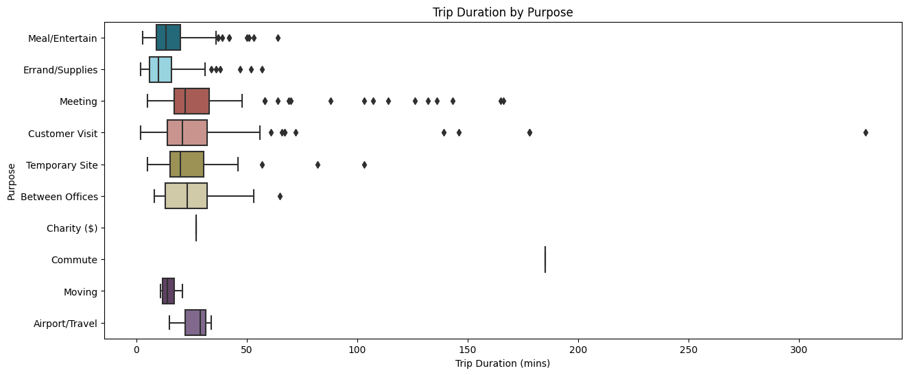
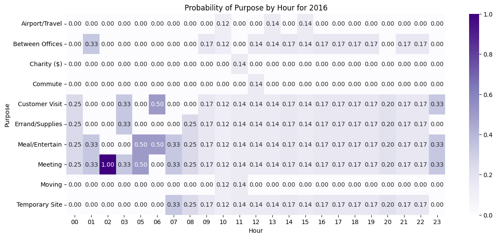

# **Uber Data Analysis: Exploring 2016 Ride Patterns in the United States**

## **Project Description**
In this analysis, I explored Uber ride data for the year 2016 within the United States. This data was obtained from Kaggle and contains ride information of 1155 different rides, including ride locations, duration, categories, distances, purpose and more. This project aimed to utilize analytical techniques and multiple Python packages to better elucidate Uber ride trends. The data underwent cleaning and preparation before exploration.

## **Technologies and Packages Used**
+ Python
+ Pandas
+ Numpy
+ Matplotlib
+ Seaborn
+ Google Colab

## **Code Structure**
**Data Preparation:** 
The initial project steps involved understanding and cleaning the data. Duplicates were removed, missing and inconsistent values were addressed, and columns were renamed for clarity.

**Data Transformation and Feature Engineering:** 
The dataset's datetime columns were converted to proper datetime format. Various features were engineered to allow for more efficient data analysis and visualization; these include Time Duration (mins), Month, Day, Hour. Month, Day, and Hour were indexed to appear properly and sorted within visualizations.

**Exploratory Data Analysis:** 
The cleaned data was utilized in multiple visualizations to best bolster analysis. The resulting visualizations and insights are as follows.

## **Results and Insights**

+ Wednesdays experience lowest demand for rides while Friday experiences highest.
+ Weekends show among the lowest of ride counts. Further investigation reveals that 93% of all rides are Business category, explaining lack of rides on weekend.
+ Ride demands fluctuate across the year, with peaks in the holiday season.
+ September experienced the lowest amount of rides at approximately 20.
  

+ There exists twilight hours from 1:00AM-6:00AM in which rides are in low demand.
+ There were exactly zero rides ordered at 4:00AM for the year of 2016.
+ There is a relatively high period for orders from 1:00PM to 6:00PM.

+ Business category rides have an average distance of about 11 miles, only 2 miles longer than Personal category trips.
+ Rides of the Commute purpose stand out as the purpose with the highest average, with an average distance of 180 miles.
+ Errand/Supplies, Airport Travel and Moving purposes are among the lowest in miles.

  

+ The boxplot shows data consisting of many outliers, with Meeting and Customer Visit experiencing the most.
+ Rides of Errand/Supplies purpose have relatively low travel distance.
+ Rides of Meeting purpose have the largest median travel distance.
+ Rides of Customer Visit purpose have variablity considered high in relativity.
  

+ A majority of all rides take under 50 minutes.
+ The data is right skewed, indicating many outliers in terms of trip duration.
+ By trip duration, rides of Commute purpose hold the highest average by far. The next highest average is customer visit.

+ Trip duration data consists of many outliers.
+ By median, Errand/Supplies trips tend to have relatively low duration, followed by trips of Meal/Entertain purpose.
+ Commute appears as though it consists of very few data points.
+ Customer Visit has the highest variability in trip duration, ranging from 1 min to more than 300.

+ At 2:00AM, the possibility that the type of ride ordered is Meeting is incredibly likely according to our contingency table.
+ At 5:00AM, there is an equal probability the type of ride ordered is either for Meeting or for Meal/Entertain.
+ Rides for Meeting purpose are likely to occur throughout the day.

  
## **Conclusion**
Many interesting and actionable insights were gained during this analysis. 

One significant observation is the distinct demand patterns across weekdays, with Wednesdays experiencing lower demand and Fridays witnessing peak demand. Interestingly enough, the weekends experienced lowest demand. This trend is supported by the fact that Business category rides constituted 93% of all rides. This presents an opportunity to diversify services or introduce incentives to attract non-business riders during weekends and to boost mid-week ridership.

Understanding the fluctuation in ride demand throughout the year, with peaks during the holiday season, provides a chance to align driver availability and incentives with increased demand periods. Additionally, providing discounted rides during periods of low ridership - like September - can increase demand.

The substantial average distance of Commute purpose rides highlights the potential to provide tailored services or packages for long-distance commuters.

The variations in ride durations for different purposes underscore the importance of accurate ride estimations for customers, ensuring a positive user experience.

In conclusion, these insights empower Uber to enhance its operational efficiency, improve customer experience, and optimize marketing strategies to meet varying customer needs and preferences. By leveraging the data-driven findings, Uber can continue to evolve its services and maintain its position as a leading ride-sharing platform.

## **License**
This project is licensed under the terms of the MIT License. 

