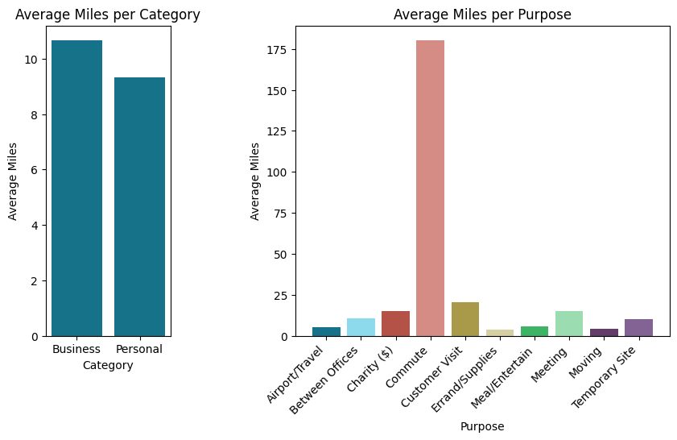

# **Uber Data Analysis: Exploring 2016 Ride Patterns in the United States**

## **Project Description**
In this analysis, I explored Uber ride data for the year 2016 within the United States. This data was obtained from Kaggle and contains ride information, including ride locations, duration, categories, distances, purpose and more. This project aimed to utilize analytical techniques and multiple Python packages to better elucidate Uber ride trends. The data underwent cleaning and preparation before exploration.

## **Technologies and Packages Used**
+ Python
+ Pandas
+ Numpy
+ Matplotlib
+ Seaborn
+ Google Colab

## **Code Structure**
**Data Preparation:** 
The initial project steps involved understanding the data and cleaning it. Duplicates were removed, missing and inconsistent values were addressed, and columns were renamed for clarity.

**Data Transformation and Feature Engineering:** 
The dataset's datetime columns were converted to proper datetime format. Various features were engineered to allow for more efficient data analysis and visualization; these include Time Duration (mins), Month, Day, Hour.

**Exploratory Data Analysis:** 
The cleaned data was utilized in multiple visualizations to best bolster analysis. The resulting visualizations and insights are as follows.

.
## **Results and Insights**

+ Wednesdays experience lowest demand for rides while Friday experiences highest.
+ Weekends show among the lowest of ride counts. Further investigation reveals that 93% of all rides are Business category, explaining lack of rides on weekend.
+ Ride demands fluctuate across the year, with peaks in the holiday season.

+ There exists twilight hours from 1:00AM-6:00AM in which rides are in low demand.
+ 

+ Business category rides have an average distance of about 11 miles, only 2 miles longer than Personal category trips.
+ Rides of the Commute purpose stand out as the purpose with the highest average, with an average distance of 180 miles.
+ 

+ The boxplot shows data consisting of many outliers, with Meeting and Customer Visit experiencing the most.
+ Rides of Errand/Supplies purpose have relatively low travel distance.
+ Rides of Meeting purpose have the largest median travel distance.
+ Rides of Customer Visit purpose have variablity considered high in relativity.

## **Conclusion**
## **License**

This project is licensed under the terms of the MIT License. 

